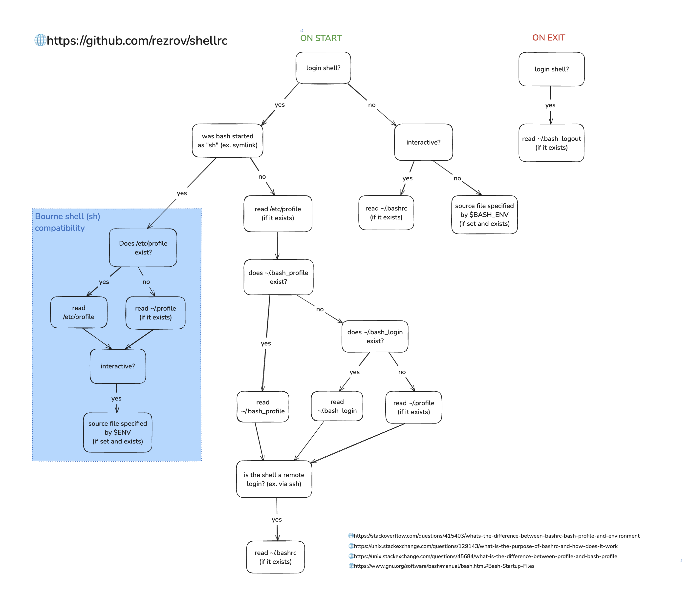

# Shellrc - Shell setup featuring Fish and Kitty #

This is a set of bash/fish configuration files and associated scripts that aim to provide a consistent interactive shell
experience across Linux and macOS. It features [fish](https://fishshell.com/) shell and the
[kitty](https://sw.kovidgoyal.net/kitty/) terminal emulator, but can be adjusted to use bash and your favorite
terminal emulator if you prefer.

## A Note For Mac Users ##

Everything here assumes you've already installed [Homebrew](https://brew.sh/). If you're using [Nix](https://nixos.org/)
or another package manager instead, you might need to tweak a few things. In any case, **you need to be using a
relatively recent version of GNU bash**, not the bash shell that comes with macOS.

Install GNU bash via your preferred package manager. To make it your default shell, follow the top answer here:
https://stackoverflow.com/questions/77052638/changing-default-shell-from-zsh-to-bash-on-macos-catalina-and-beyond

## Prerequisites ##

* [fish](https://fishshell.com/) shell (optional)
* [kitty](https://sw.kovidgoyal.net/kitty/) terminal emulator (optional)
* [Nerd Fonts](https://github.com/ryanoasis/nerd-fonts) (optional, see below)

If you choose to omit kitty or fish, you might need to tweak some of the configuration settings.

## Installation ##

I recommend forking this repo and cloning your own version so you can track your own modifications and selectively merge
any upstream improvements I make in the future. If you come up with something cool, send me a pull request and I'll take
a look.

Once you've got your own fork, run the following:

```bash
cd
mkdir backuprc
mv .bashrc .profile .bash_profile .bash_login .bash_logout .shellrc backuprc
git clone https://github.com/yourusername/shellrc.git .shellrc
ln -s .shellrc/profile.bash .profile
ln -s .shellrc/bashrc.bash .bashrc
```

MacOS users only: Since your bash environment variables won't be supplied to the
kitty process when it starts up, you'll need to symlink the kitty configuration file
from its default location to the one in your .shellrc directory. (If you find a better
way to do this, let me know.)

```bash
# MacOS only
mkdir -p ~/.config/kitty
mv -f ~/.config/kitty/kitty.conf ~/.config/kitty/kitty.conf.backup
ln -s ~/.shellrc/kitty/macos/kitty.conf ~/.config/kitty/kitty.conf
```

After you've completed installation and read the explanation of all the installed files below, review the contents of 
backuprc/ to see if there's anything there you want to pull back into your new configuration. After you've done that,
you can delete backuprc/.

Now you're ready to try the new stuff. Close all your terminals (on macOS, right-click 
the kitty icon in the menu bar and select "Quit") and open a new kitty session. You should have a new
fish shell, with all your bash/fish configuration organized nicely in the .shellrc directory. If kitty won't launch,
start another terminal emulator and double-check the path to your fish and bash shell binaries in the config files 
under .shellrc/kitty, in the "shell" directive. This will likely be necessary if you're on macOS and either using a
package manager other than Homebrew, or on an older Intel Mac.

### How Am I Getting Fish Shell? ###

Regardless of your default shell settings, kitty is now pulling in some custom configuration from your new .shellrc 
directory. The "shell" directive in the config files under .shellrc/kitty starts by invoking GNU bash to process all 
the startup scripts, then execs the kitty shell which inherits the environment constructed by bash. If you want to 
use your system default shell instead, comment out the "shell" directive. You can always run "exec fish" from bash (or 
use the convenient "ef" alias provided in this configuration) to switch to fish shell.

## But Wait, There's More! ##

Perform the following steps to make the most of your new shell configuration.

### Fonts ###

You should install a patched monospace font on your system that's designed for easy reading and supports some of the 
advanced features of kitty and fish shell. I've included the JetBrains Mono
fonts from [ryanoasis/nerd-fonts](https://github.com/ryanoasis/nerd-fonts) in the fonts/ directory, since those are my
personal preference. Install those, or one of the other monospace options available in the "patched-fonts" directory of nerd-fonts.

Once the font of your choice is installed, edit the kitty.conf files in ~/.shellrc/kitty/ and uncomment
the font_family and font_size lines. While you're there, review the other settings and uncomment/adjust as you like.
Restart kitty to make the changes take effect.

### Fish Shell Configuration ###

Redirect the system-installed fish configuration to the version in your .shellrc directory:

```fish
mkdir -p ~/.config/fish
mv -f ~/.config/fish/config.fish ~/.config/fish/config.fish.orig
ln -s ~/.shellrc/config.fish ~/.config/fish/config.fish
```

Take a look at .shellrc/config.fish now if you'd like to see what it's going to do. 

### Oh My Fish ###

[Oh My Fish](https://github.com/oh-my-fish/oh-my-fish) is a popular plugin manager for fish shell. There are others out 
there if you prefer an alternative.

Install and configure OMF, BobTheFish (a theming plugin) and a couple other things from within fish shell:

```fish
set -U theme_date_timezone EST5EDT
set -U theme_date_format "+%Y-%m-%d %H:%M:%S"
set -U theme_nerd_fonts yes         # assumes you installed a font from nerd-fonts as described above
set -U theme_powerline_fonts yes
set -U theme_color_scheme tomorrow-night
curl -L https://raw.githubusercontent.com/oh-my-fish/oh-my-fish/master/bin/install -o fishsetup.tmp.fish
fish ./fishsetup.tmp.fish --noninteractive -y
rm -f ./fishsetup.tmp.fish
echo 'omf install fish_logo colorman bobthefish' | fish
```

Close and reopen your fish shell to see the changes.

### Get Your Git Under Control ###

Optionally, put your git configuration in the .shellrc/ directory to get it into version control.
Edit the file ~/.gitconfig and add the following:

```
[include]
    path = ~/.shellrc/gitinclude
```

Open up .shellrc/gitinclude, delete anything you don't like, and pull in your personal configuration 
preferences. I recommend putting everything from ~/.gitconfig into this file that you might want to share across
multiple machines.

## A Tour Of The Stuff You Just Installed ##

One of the key considerations in setting up this configuration was to provide organization and consistency across 
multiple systems.
Shell configuration can get awfully complex (see Bash Startup section below) and if you don't keep things organized,
it can be hard to track down problems.

Take a look at each of the files below and make modifications where appropriate. Each file indicates whether or not it
should be modified, and where those modifications should go, in header comments. If you can keep your changes in the
indicated locations, it will be easier to merge upstream changes later.

### bash_aliases.bash ###

This file contains all your shell aliases. Since the fish startup script will import these aliases,
you can define both bash and fish aliases in this file.

### bash_functions.bash ###

Bash shell functions used by other scripts in this configuration. Generally you won't want to
modify this file.

### bash_functions_custom.bash ###

Put your custom bash functions in this file.

### bash_local_envs.bash ###

Put environment variables (not including $PATH) and other shell settings that are only relevant for interactive shells 
in this file.

### bash_local_paths.bash ###

Put $PATH modifications that are relevant only for interactive shells in this file.

### bash_system_envs.bash ###

Put environment variables (not including $PATH) and other shell settings for relevant for both interactive and 
non-interactive shells in this file.

### bash_system_paths.bash ###

Put $PATH modifications relevant for both interactive and non-interactive shells in this file.

### bash_set_colors.bash ###

Sets colors for directory listings, and the cursor style.

### fish_functions.fish

Custom fish functions used by other scripts in this configuration. Generally you won't want to
modify this file.

### fish_functions_custom.fish ###

Put your custom fish functions in this file.

### gitinclude ###

This file is intended to be included from your ~/.gitconfig file. Put your personal git configuration here.

### profile.bash ###

This file is intended to be symlinked from ~/.profile. Generally you won't want to modify this file.

## Bash Startup ##

Here's a diagram I built to help make sense of bash startup and configuration. If you're having issues, this might help
you understand what's going on.



Complicated! Nonetheless, I chose to do all configuration in bash instead of fish because this results in a more
flexible environment when both are being used. When fish shell is invoked from bash, it inherits the environment
constructed during bash startup.

## Contributing ##

If you have any suggestions or find any bugs, please [open an issue](https://github.com/rezrov/shellrc/issues).

I've been tweaking these scripts on and off for a few years. They're pretty specific to my personal needs, so if you 
come up with something that might be useful to others, send me a pull request and I'll take a look.

Thanks!

