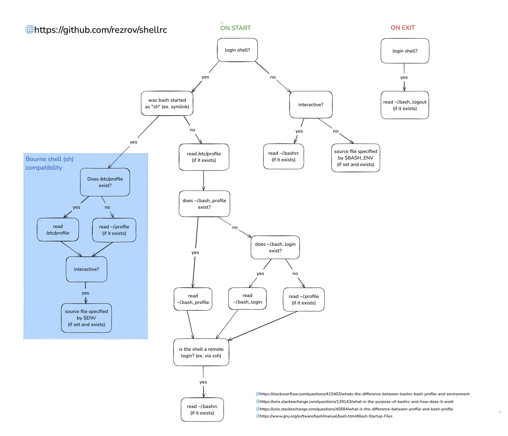

# Shellrc - Shell setup featuring Fish and Kitty #

This is a set of bash/fish configuration files and associated scripts that aim to provide a consistent, rich interactive shell
experience across Linux and macOS. It features [fish](https://fishshell.com/) shell and the
[kitty](https://sw.kovidgoyal.net/kitty/) terminal emulator, but can be adjusted to use bash and your favorite
terminal emulator if you prefer.

## A Few Notes For Mac Users ##

**Apple Silicon Macs only.** This project hardcodes the Homebrew prefix at `/opt/homebrew` and is not tested or
supported on Intel Macs.

Everything here assumes you've already installed [Homebrew](https://brew.sh/). If you're using [Nix](https://nixos.org/)
or another package manager instead, you might need to tweak a few things. In any case, **you need to be using a
relatively recent version of GNU bash**, not the bash shell that comes with macOS. This project also relies on the
GNU versions of `sed`, `tar`, `grep`, and the `findutils` family being on your `$PATH` (several helper functions 
and aliases use GNU-only flags, and `bash_system_paths.bash` prepends the Homebrew `gnubin` directories accordingly).
To install them with Homebrew:

```bash
brew install gnu-sed gnu-tar grep findutils uutils-coreutils
```

To make bash your default shell (recommended), follow the top answer here:
https://stackoverflow.com/questions/77052638/changing-default-shell-from-zsh-to-bash-on-macos-catalina-and-beyond

Once you have bash set as your system default, exit your current terminal and start a new one to pick up the change.

## Prerequisites ##

* [fish](https://fishshell.com/) shell (optional)
* [kitty](https://sw.kovidgoyal.net/kitty/) terminal emulator (optional)
* [Nerd Fonts](https://github.com/ryanoasis/nerd-fonts) (optional, see below)

If you choose to omit kitty or fish, you might need to tweak some of the configuration settings. macOS users can install
the "fish" and "kitty" packages via Homebrew. It's also a good idea to install the package "kitty-terminfo" on any
system you will be logging into remotely via SSH, it's available in most Linux package managers.

## Installation ##

I highly recommend forking this repo and cloning your own version so you can track your own modifications and selectively merge
any upstream improvements I make in the future. If you come up with something cool, send me a pull request and I'll take
a look.

Once you've got your own fork, run the following (replace 'yourusername' with your github user):

```bash
cd
mkdir -p backuprc
for f in .bashrc .profile .bash_profile .bash_login .bash_logout .shellrc; do
  if [ -e "$f" ] || [ -L "$f" ]; then
    mv "$f" backuprc/
  fi
done
git clone https://github.com/yourusername/shellrc.git .shellrc
ln -sf .shellrc/profile.bash .profile
ln -sf .shellrc/bashrc.bash .bashrc
```

Your original shell startup files are now moved to ~/backuprc, and all of your shell
startup configuration is now contained in the cloned repo under ~/.shellrc. You can
delete ~/backuprc when you feel comfortable doing so.

macOS users only: Since your bash environment variables won't be supplied to the
kitty process when it starts up, you'll need to symlink the kitty configuration file
from its default location to the one in your .shellrc directory. (If you find a better
way to do this, let me know.)

```bash
# MacOS only
mkdir -p ~/.config/kitty
if [ -e ~/.config/kitty/kitty.conf ] || [ -L ~/.config/kitty/kitty.conf ]; then
  mv -f ~/.config/kitty/kitty.conf ~/.config/kitty/kitty.conf.backup
fi
ln -sf ~/.shellrc/kitty/macos/kitty.conf ~/.config/kitty/kitty.conf
```

Linux users: on Linux, the kitty config we use is selected via the `KITTY_CONFIG_DIRECTORY`
environment variable, exported by `bash_system_envs.bash`. Some desktop session managers
(notably systemd-managed user sessions launching kitty directly from a `.desktop` file)
start kitty without first sourcing `~/.profile`, so the variable is unset and kitty falls
back to your default `~/.config/kitty/kitty.conf` instead of ours. If you hit this, add
the following to your `~/.xprofile` (or your desktop's equivalent of a per-session login
script):

```bash
source ~/.profile
```

After logging out and back in, `KITTY_CONFIG_DIRECTORY` will be set in your session
environment and kitty will pick up the right config.

After you've completed installation and read the explanation of all the installed files below, review the contents of 
backuprc/ to see if there's anything there you want to pull back into your new configuration.

Now you're ready to try the new stuff. Close all your terminals (on macOS, right-click 
the kitty icon in the menu bar and select "Quit") and open a new kitty session. You should have a new
fish shell, with all your bash/fish configuration organized nicely in the .shellrc directory. If kitty won't launch,
start another terminal emulator and double-check the path to your fish and bash shell binaries in the config files
under .shellrc/kitty, in the "shell" directive. This will likely be necessary if you're on macOS and using a
package manager other than Homebrew.

### How Am I Getting Fish Shell? ###

Regardless of your default shell settings, kitty is now pulling in some custom configuration from your new .shellrc 
directory. The "shell" directive in the config files under .shellrc/kitty starts by invoking GNU bash to process all 
the startup scripts, then execs the kitty shell which inherits the environment constructed by bash. If you want to 
use your system default shell instead, comment out the "shell" directive. You can always run "exec fish" from bash (or 
use the convenient "ef" alias provided in this configuration) to switch to fish shell.

## But Wait, There's More! ##

Perform the following steps to make the most of your new shell configuration.

### Fonts ###

You should install a patched monospace font on your system that's designed for easy reading and supports some of the 
advanced features of kitty and fish shell. I've included the JetBrains Mono
fonts from [ryanoasis/nerd-fonts](https://github.com/ryanoasis/nerd-fonts) in the fonts/ directory, since those are my
personal preference. Install those, or one of the other monospace options available in the "patched-fonts" directory of nerd-fonts.

Once the font of your choice is installed, edit the kitty.conf files in ~/.shellrc/kitty/ and uncomment
the font_family and font_size lines. While you're there, review the other settings and uncomment/adjust as you like.
Restart kitty to make the changes take effect.

### Fish Shell Configuration ###

Redirect the system-installed fish configuration to the version in your .shellrc directory:

```fish
mkdir -p ~/.config/fish
if test -e ~/.config/fish/config.fish; or test -L ~/.config/fish/config.fish
    mv -f ~/.config/fish/config.fish ~/.config/fish/config.fish.orig
end
ln -sf ~/.shellrc/config.fish ~/.config/fish/config.fish
```

Take a look at .shellrc/config.fish now if you'd like to see what it's going to do. 

### Fisher and Tide ###

[Fisher](https://github.com/jorgebucaran/fisher) (plugin manager)
[Tide](https://github.com/IlanCosman/tide) (fancy shell prompt)

Install Fisher, then Tide, from within fish shell:

```fish
curl -sL https://raw.githubusercontent.com/jorgebucaran/fisher/main/functions/fisher.fish | source && fisher install jorgebucaran/fisher
fisher install IlanCosman/tide@v6
```

Tide's default prompt activates immediately. To customize, run `tide configure` and walk through the interactive
wizard. The wizard explicitly asks whether you have a Nerd Font installed; answer accordingly so the icon set matches
what your terminal can render.

If you'd like an attractive starting point you can refine later, the following non-interactive command applies a
two-line rainbow prompt with Nerd-Font glyphs (assumes you've installed a Nerd Font as described above):

```fish
tide configure --auto --style=Rainbow --prompt_colors='True color' --show_time=No --rainbow_prompt_separators=Round --powerline_prompt_heads=Round --powerline_prompt_tails=Round --powerline_prompt_style='Two lines, character and frame' --prompt_connection=Solid --powerline_right_prompt_frame=No --prompt_connection_andor_frame_color=Darkest --prompt_spacing=Sparse --icons='Many icons' --transient=Yes
```

Re-run `tide configure` interactively any time you want to adjust.

If you'd like a colorful fish logo printed each time you start a fresh interactive shell, install
`laughedelic/fish_logo`:

```fish
fisher install laughedelic/fish_logo
```

The bundled `config.fish` detects this via `functions -q fish_logo` and calls it on interactive shell startup.

For other Fisher plugins, browse [awesome-fish](https://github.com/jorgebucaran/awesome-fish). Fisher's API is
intentionally tiny: `fisher install user/repo`, `fisher remove user/repo`, `fisher list`, `fisher update`.

### Get Your Git Under Control ###

Optionally, put your git configuration in the .shellrc/ directory to get it into version control.
Edit the file ~/.gitconfig and add the following:

```
[include]
    path = ~/.shellrc/gitinclude
```

Open up .shellrc/gitinclude, delete anything you don't like, and pull in your personal configuration 
preferences. I recommend putting everything from ~/.gitconfig into this file that you might want to share across
multiple machines.

## A Tour Of The Stuff You Just Installed ##

One of the key considerations in setting up this configuration was to provide organization and consistency across 
multiple systems.
Shell configuration can get awfully complex (see Bash Startup section below) and if you don't keep things organized,
it can be hard to track down problems.

Take a look at each of the files below and make modifications where appropriate. Each file indicates whether or not it
should be modified, and where those modifications should go, in header comments. If you can keep your changes in the
indicated locations, it will be easier to merge upstream changes later.

### bash_aliases.bash ###

This file contains all your shell aliases. Since the fish startup script will import these aliases,
you can define both bash and fish aliases in this file.

### bash_functions.bash ###

Bash shell functions used by other scripts in this configuration. Generally you won't want to
modify this file.

### bash_functions_custom.bash ###

Put your custom bash functions in this file.

### bash_interactive_envs.bash ###

Put environment variables (not including $PATH) and other shell settings that are only relevant for interactive shells 
in this file.

### bash_interactive_paths.bash ###

Put $PATH modifications that are relevant only for interactive shells in this file.

### bash_local_interactive.bash ###

Optional .gitignored hook for host-specific interactive customizations (API tokens, work paths, machine-only aliases).
Create this file in `~/.shellrc/` to opt in; it's sourced at the end of `bashrc.bash` so its values override earlier
defaults.

### bash_local_system.bash ###

Optional .gitignored hook for host-specific env or PATH modifications that need to apply to all shells, not just
interactive ones. Create this file in `~/.shellrc/` to opt in; it's sourced at the end of `bash_system_envs.bash`.

### bash_system_envs.bash ###

Put environment variables (not including $PATH) and other shell settings relevant for both interactive and 
non-interactive shells in this file.

### bash_system_paths.bash ###

Put $PATH modifications relevant for both interactive and non-interactive shells in this file.

### bash_set_colors.bash ###

Centralized color setup for interactive bash shells: `LS_COLORS` (GNU/uutils ls), `LSCOLORS` (BSD ls), a tput-gated
colored `PS1`, and `FORCE_COLOR` for tools that respect it. See header comments in the file for details.

### dircolors ###

Color definitions for GNU `dircolors`, sourced by `bash_set_colors.bash` to populate `LS_COLORS`. Solarized 256-color
scheme from github.com/seebi/dircolors-solarized; swap or edit to change how `ls` colors files. After editing,
regenerate the embedded fallback in `bash_set_colors.bash` with `dircolors -b ~/.shellrc/dircolors`.

### bashrc.bash ###

This file is intended to be symlinked from ~/.bashrc. The entry point for interactive bash shells. Generally you
won't want to modify this file.

### config.fish ###

This file is intended to be symlinked from ~/.config/fish/config.fish. The entry point for fish shell. Customizations
belong inside the "MODIFICATIONS HERE" block.

### fish_functions.fish ###

Fish shell functions used by other scripts in this configuration. Generally you won't want to
modify this file.

### fish_functions_custom.fish ###

Put your custom fish functions in this file.

### bin/fish_aliases.bash ###

Reads aliases from `bash_aliases.bash` and re-emits them in fish syntax. Invoked by `config.fish` at fish startup.
Don't modify directly — keep aliases in `bash_aliases.bash` valid for both shells (avoid bash-only constructs like
`$()` or arrays).

### gitinclude ###

This file is intended to be included from your ~/.gitconfig file. Put your personal git configuration here.

### fonts/ ###

JetBrains Mono Nerd Font TTF files, bundled for convenience. Install them at the OS level (Font Book on macOS;
`~/.local/share/fonts/` plus `fc-cache -fv` on Linux). Referenced (commented out) in the kitty configs.

### kitty/ ###

Per-OS kitty terminal configurations under `macos/` and `linux/` subdirectories, each with a `kitty.conf` containing
the right paths to bash and fish for that OS. The Linux variant is selected automatically via
`$KITTY_CONFIG_DIRECTORY`; macOS uses a manual symlink (see install section).

### profile.bash ###

This file is intended to be symlinked from ~/.profile. Generally you won't want to modify this file.

## Bash Startup ##

Here's a diagram I built to help make sense of bash startup and configuration. If you're having issues, this might help
you understand what's going on.



Complicated! Nonetheless, I chose to do all configuration in bash instead of fish because this results in a more
flexible environment when both are being used. When fish shell is invoked from bash, it inherits the environment
constructed during bash startup.

## Contributing ##

If you have any suggestions or find any bugs, please [open an issue](https://github.com/rezrov/shellrc/issues).

I've been tweaking these scripts on and off for a few years. They're pretty specific to my personal needs, so if you 
come up with something that might be useful to others, send me a pull request and I'll take a look.

Thanks!

